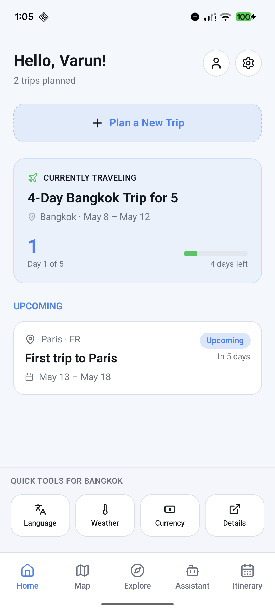
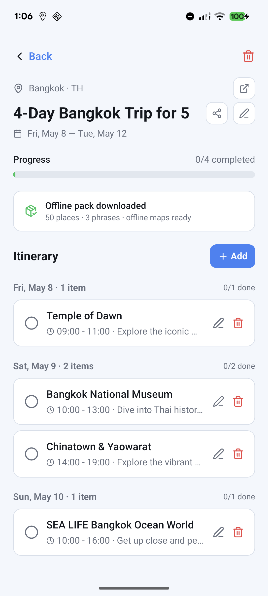
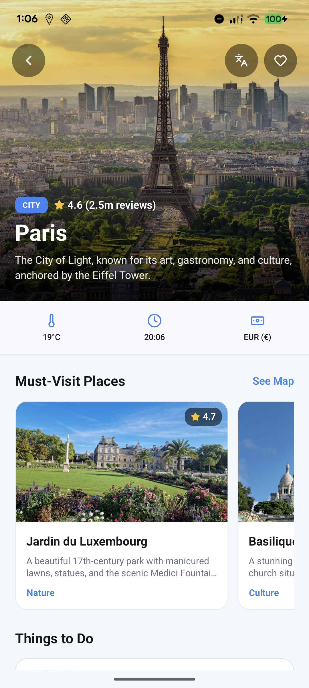
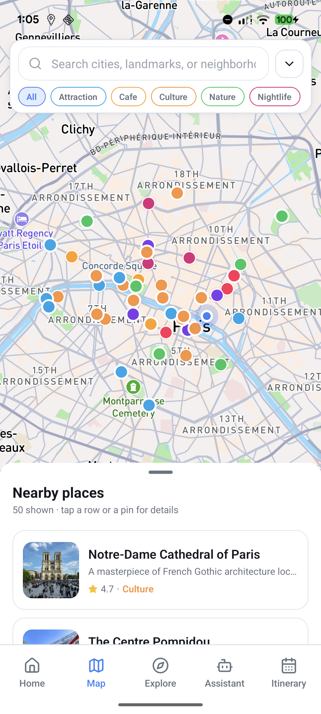
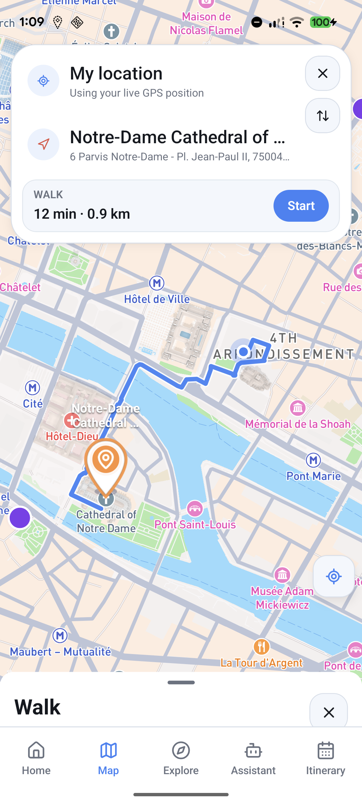
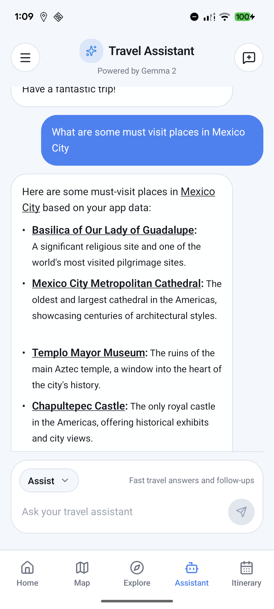
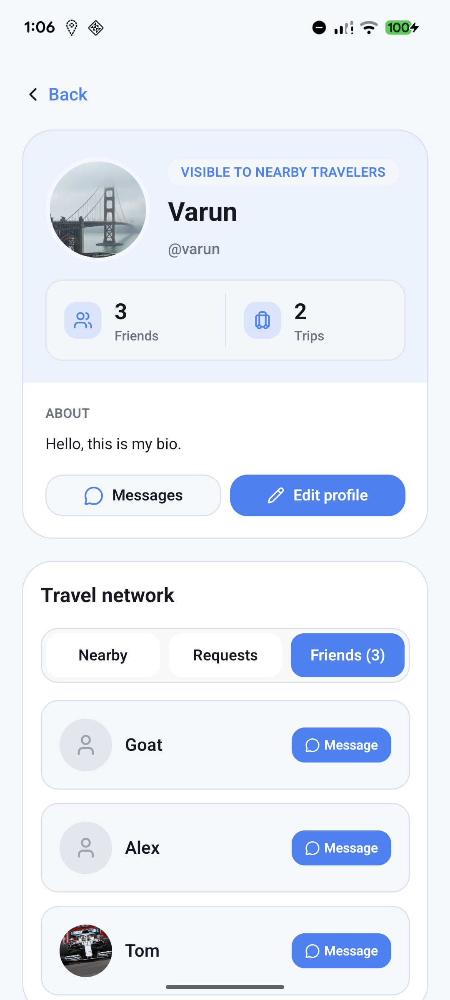

# Roamie

<p align="center">
  <strong>Your trip, one app, even when the signal disappears.</strong>
</p>

<p align="center">
  <a href="https://app.travel-comp.xyz"><strong>Download Roamie</strong></a>
</p>

Roamie is an offline-first travel companion built to keep everything important in one place: your itinerary, destination picks, maps, language help, and AI travel support. Instead of juggling five different apps while traveling, you open one app and keep moving.

## Why Roamie

- Plan trips and manage day-by-day itineraries in a clean mobile experience.
- Explore curated destinations, must-visit places, and practical travel details.
- Use interactive maps and navigation when you are exploring a new city.
- Keep core travel info available offline after downloading a destination pack.
- Ask an on-device AI assistant for ideas, planning help, and quick answers.
- Connect with nearby travelers through the built-in social layer.

## Glimpses Of The App

<table>
  <tr>
    <td align="center">
      
      <br />
      <sub>Trip dashboard</sub>
    </td>
    <td align="center">
      
      <br />
      <sub>Itinerary planning</sub>
    </td>
    <td align="center">
      
      <br />
      <sub>Destination discovery</sub>
    </td>
  </tr>
  <tr>
    <td align="center">
      
      <br />
      <sub>Interactive city maps</sub>
    </td>
    <td align="center">
      
      <br />
      <sub>Turn-by-turn guidance</sub>
    </td>
    <td align="center">
      
      <br />
      <sub>On-device AI assistant</sub>
    </td>
  </tr>
  <tr>
    <td align="center" colspan="3">
      
      <br />
      <sub>Social travel network</sub>
    </td>
  </tr>
</table>

## Tech Stack

- Mobile: React Native, Expo, TypeScript, Expo Router, NativeWind
- State and data: Zustand, TanStack Query, AsyncStorage
- Maps and travel UX: Mapbox, offline packs, in-app navigation
- AI: Gemma 2 running on-device with `llama.rn`
- Backend: ElysiaJS on Bun, PostgreSQL, Prisma
- Monorepo: Turborepo with pnpm workspaces

## Project Info

- Team: Team 11
- Members: Varun Mange, Allen Paul, Darius Rafeh, Kapil Yadav
- University: The University of Texas at Dallas
- Supervisor: Professor Sridhar Alagar
- Project Coordinator: Adarsh Gella

## Local Development

```bash
pnpm install
pnpm dev
```

For environment setup and platform-specific steps, see [setup.md](./setup.md).

Download the app at [app.travel-comp.xyz](https://app.travel-comp.xyz).
